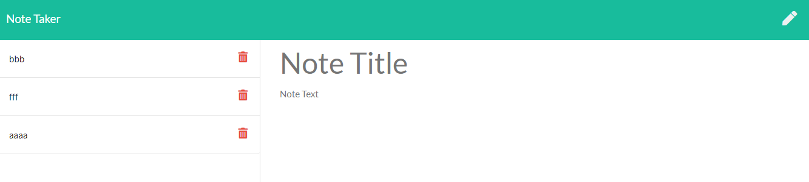

# Note Taker

## Description 
This is homework 11, a note taker with a client and server

## Table of Contents 
[Installation](#installation)

[Usage](#usage)

[License](#license)

[Contributing](#contributing)

[Tests](#tests)

[Questions](#questions)
## Installation
Download the source code, then in the folder with server.js run "npm install".

## Usage
In the folder with server.js run "npm start". Then in a browser navigate to http://localhost:3001/.

## License
This is licensed under the [MIT license](https://choosealicense.com/licenses/mit/).

## Contributing
Feel free to contribute

## Tests
No tests at the moment

## Questions
GitHub: https://github.com/tober65
Email: timothy.ober@gmail.com